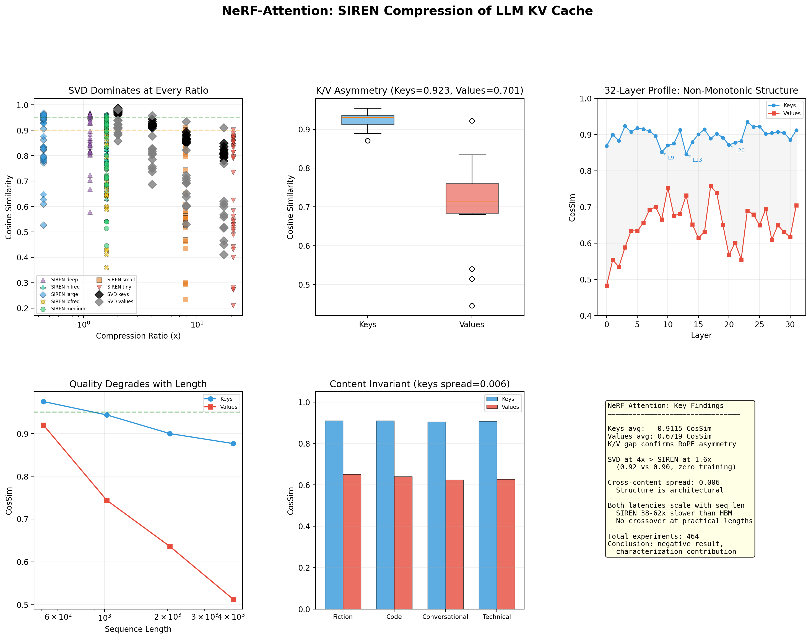

# NeRF-Attention: SIREN KV Cache Compression

Can we replace KV cache *memory reads* with *compute* using implicit neural
representations? During autoregressive LLM decoding, the GPU reads the entire
KV cache from HBM every token — arithmetic intensity ~2 FLOP/byte, meaning the
GPU sits idle waiting for data. A small SIREN network mapping
`f(position) -> KV_vector` could theoretically shift this from IO-bound to
compute-bound.

**Short answer: no.** But the structural characterization is interesting.



## Results

**280 SIREN fits** across 7 architectures, 5 layers, 4 KV heads on Llama 3.1-8B (2048 tokens):

| | Keys | Values |
|---|---|---|
| Avg CosSim | 0.9115 | 0.6719 |
| Lag-1 Autocorrelation | 0.496 | 0.242 |

Keys have learnable positional structure from RoPE. Values don't — they encode
token-specific content with no systematic relationship to sequence position.

**SVD dominates at every compression ratio with zero training:**

| Compression | SVD Keys | SVD Values | SIREN Keys (1.6x) |
|---|---|---|---|
| 2x | 0.9745 | 0.9124 | 0.90 |
| 4x | 0.9225 | 0.8032 | — |

**SIREN is 38-62x slower than HBM reads** at every tested sequence length
(512-4096 tokens). Both scale with length — no crossover at practical lengths.

**Content invariant:** Keys span just 0.006 CosSim across fiction, code,
conversational, and technical text. The K/V asymmetry is architecturally
imposed by RoPE, not content-driven.

See [FINDINGS.md](FINDINGS.md) for the full writeup.

## Reproduce

```bash
uv sync
uv run quickstart          # synthetic data, no model download needed
uv run quickstart --cpu    # CPU only
```

### Full experiment (Llama 3.1-8B, needs ~8GB VRAM)

```bash
uv sync --extra llm

uv run python -m nerf_attention.extract --model unsloth/Llama-3.1-8B --seq_len 2048
uv run python -m nerf_attention.analyze
uv run python -m nerf_attention.fit --epochs 2000
uv run python -m nerf_attention.evaluate
```

## Hardware

All experiments ran locally on:
- RTX 4060 (8GB VRAM) — Llama 3.1-8B fits at 4-bit quantization (~5GB)
- ~16GB system RAM

H100 numbers referenced in scaling analysis are theoretical, computed from
published specs (3.35 TB/s bandwidth) — not measured on actual H100 hardware.

## Pipeline

1. **Extract** — Load model, run inference, save per-layer KV tensors
2. **Analyze** — Measure autocorrelation, spectral energy, effective rank per layer/head
3. **Fit** — Sweep 7 SIREN architectures (width 64-512, depth 1-3, omega_0 15-60)
4. **Evaluate** — Figures, SVD baseline comparison, latency profiling

## Methodology Limitations

- Quality measured by cosine similarity only — no perplexity or generation evaluation
- 4 of 8 KV heads sampled per layer in baseline experiments
- Fixed 2000 epochs with no early stopping or convergence verification
- No random seeds set — qualitative patterns are stable but exact numbers aren't reproducible
